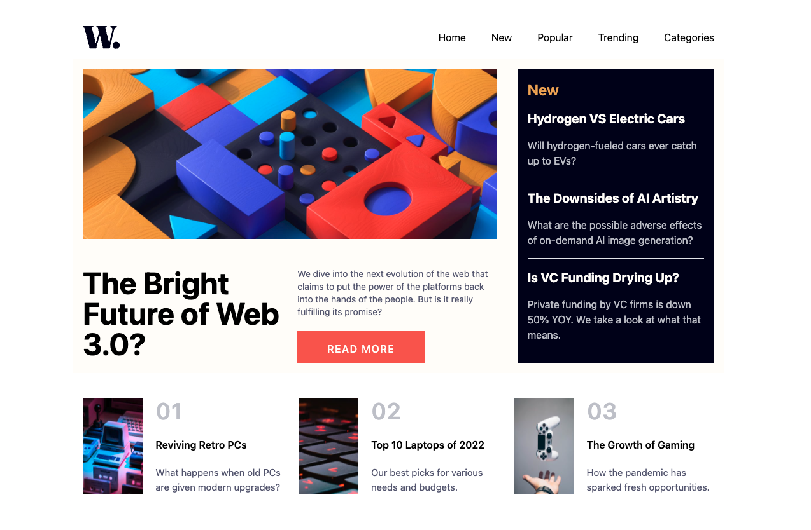
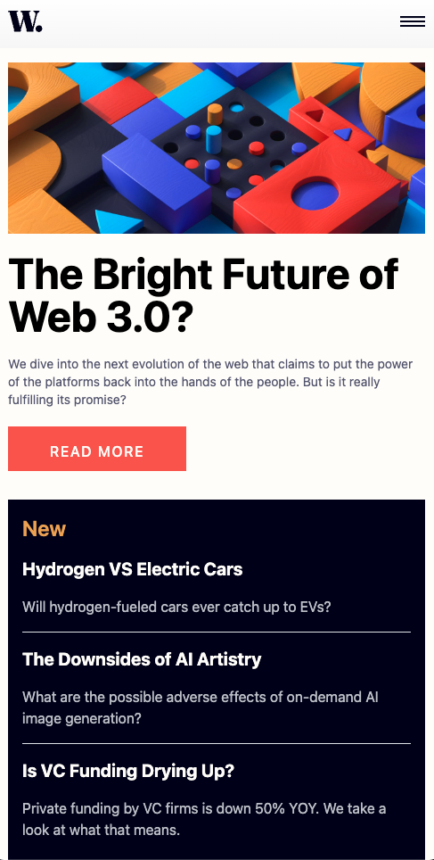

# Frontend Mentor - News homepage solution

This is a solution to the [News homepage challenge on Frontend Mentor](https://www.frontendmentor.io/challenges/news-homepage-H6SWTa1MFl). Frontend Mentor challenges help you improve your coding skills by building realistic projects. 

## Table of contents

- [Overview](#overview)
  - [The challenge](#the-challenge)
  - [Screenshot](#screenshot)
  - [Links](#links)
- [My process](#my-process)
  - [Built with](#built-with)
  - [What I learned](#what-i-learned)
  - [Continued development](#continued-development)
  - [Useful resources](#useful-resources)
- [Author](#author)

## Overview

### The challenge

Users should be able to:

- View the optimal layout for the interface depending on their device's screen size
- See hover and focus states for all interactive elements on the page

### Screenshot

### Links

- Solution URL: [Add solution URL here](https://www.frontendmentor.io/solutions/news-page-using-next-and-tailwind-Lm0VUN1gAN)
- Live Site URL: [Add live site URL here](https://news-page-ten.vercel.app/)

## My process

### Built with

- Semantic HTML5 markup
- CSS custom properties
- Flexbox
- CSS Grid
- Mobile-first workflow
- [React](https://reactjs.org/) - JS library
- [Next.js](https://nextjs.org/) - React framework
- [TailwindCSS](https://https://tailwindcss.com/) - For styles

### What I learned

I had to use nested grids to arrage the sections in the desktop view. Unlike flexbox, it requires way more set up and a more methodical approach.

Another interesting thing was creating the mobile menu as a sidebar and use state to toggle the menu.

### Continued development

In my next projects, I want to gain some experience with more advanced grid layouts as they can make some very attractive designs

### Useful resources

- [This Medium post](https://medium.com/@ryaddev/creating-a-responsive-navbar-with-react-and-tailwind-css-502cceaf9f53) - It helped me to figure out how to make the navbar responsive.

## Author

- Website - [Angelo Ilardi](https://angelo-ilardi.vercel.app/)
- Frontend Mentor - [@helldorado82](https://www.frontendmentor.io/profile/helldorado82)
- LinkedIn - [@angelo-ilardi](https://www.linkedin.com/in/angelo-ilardi/)

